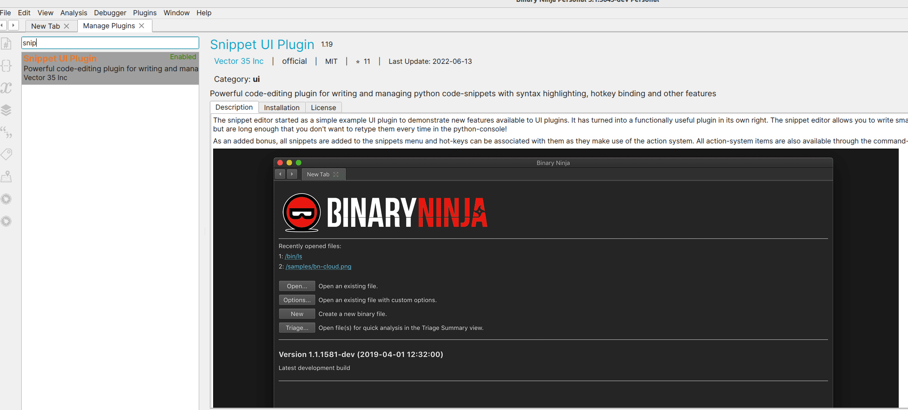

## 概要
Binaryninjaのlibc用の型ライブラリ(binaryninja/typelib/x86_64/libc.so.6.bntl)を改良した型ライブラリを作成/公式の型ライブラリに復元するPythonスクリプトです。

改良した型ライブラリは、libcの関数で使われるint型の定数をenum型の定数に置き換えています。その結果、以下の画像のようにopen()のflag定数やmmap()のprot flag定数を見やすく表示することができます。

### ./test_binary/testの解析例
#### Before

#### After

## 使用方法
1. 公式のSnippetsプラグインをインストールする
(Snippetsプラグインを使うと、Pythonのスニペットコードを保存できる/Command Palletからスニペットコードを呼び出せるようになるのでオススメ！)

1. [Download_Type_Lib.py](./snippets/Download_Type_Lib.py)、[Restore_Type_Lib.py](./snippets/Restore_Type_Lib.py)、[Build_Type_Lib.py](./snippets/Build_Type_Lib.py)をSnippetsフォルダに入れる(Linuxなら~/.binaryninja/snippets/)
2. Command Palette(Cntl + P)からDownload_Type_Libを選択し実行する

## 復元方法
1. Command Palette(Cntl + P)からRestore_Type_Libを選択し実行する
