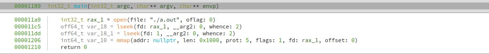
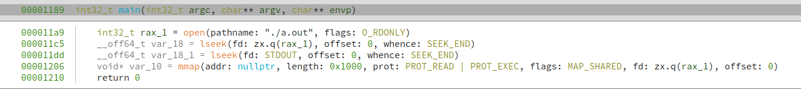

## build_custom_libc_typelib.py
既存のlibc用の型ライブラリ(binaryninja/typelib/x86_64/libc.so.6.bntl)を改良した型ライブラリを作成(binaryninja/typelib/x86_64/_libc.so.6.bntl)する~~プラグイン~~スクリプトです。

改良した型ライブラリは、libcの関数で使われるint型の定数をenum型の定数に置き換えています。その結果、以下の画像のようにopen()のflag定数やmmap()のprot flag定数を見やすく表示することができます。

### ./test_binary/testの解析例
#### Before

#### After

## 注意点