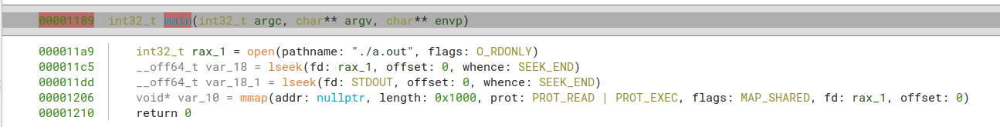

## my_type_lib.py
Binaryninjaのlibc用の型ライブラリ(binaryninja/typelib/x86_64/libc.so.6.bntl)を改良した型ライブラリを作成/復元するプラグインです。

改良した型ライブラリは、libcの関数で使われるint型の定数をenum型の定数に置き換えています。その結果、以下の画像のようにopen()のflag定数やmmap()のprot flag定数を見やすく表示することができます。

### ./test_binary/testの解析例
#### Before

#### After

## 使用方法 
1. ./my_type_lib.pyをプラグインフォルダに入れる(Linuxなら~/.binaryninja/plugins/)
2. Binaryninja起動後にPlugins->My type library->build type libraryを選択
 
4. 次回Binaryninja起動後から改良した型ライブラリが適用される

## 復元方法
Plugins->My type library->restore type library
を選択することで公式の型ライブラリを復元できる